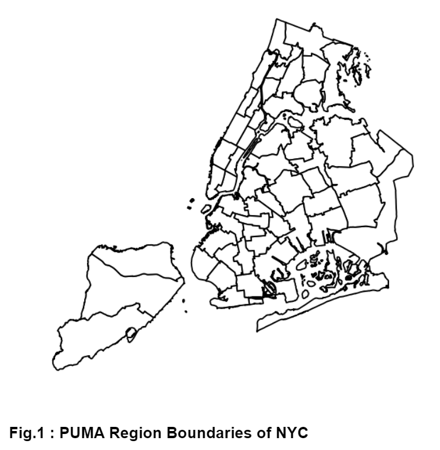
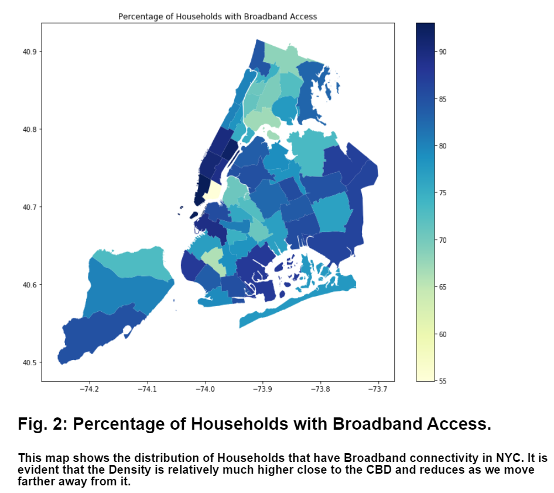
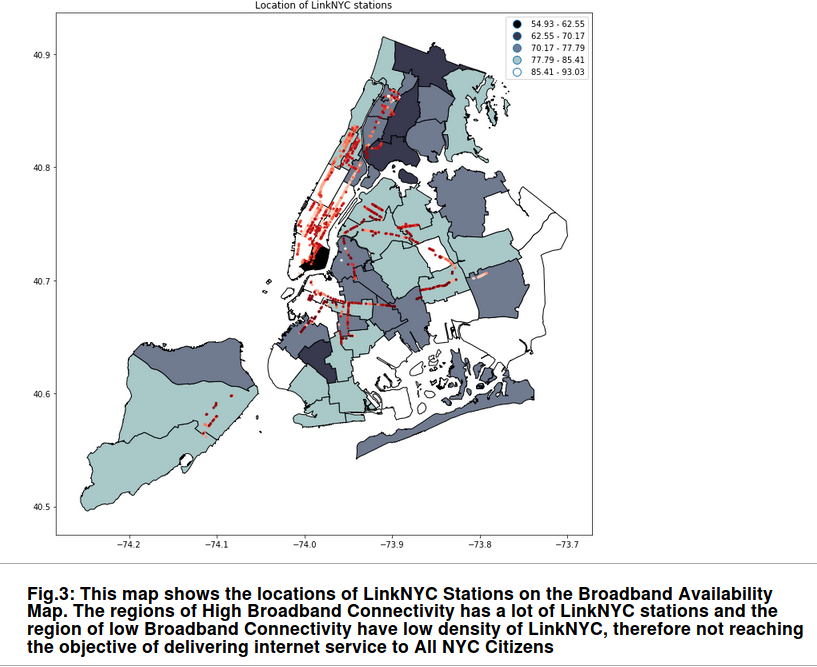
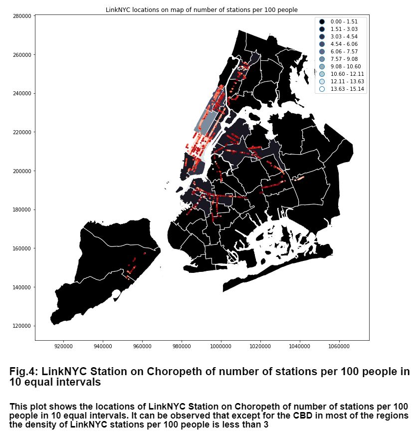
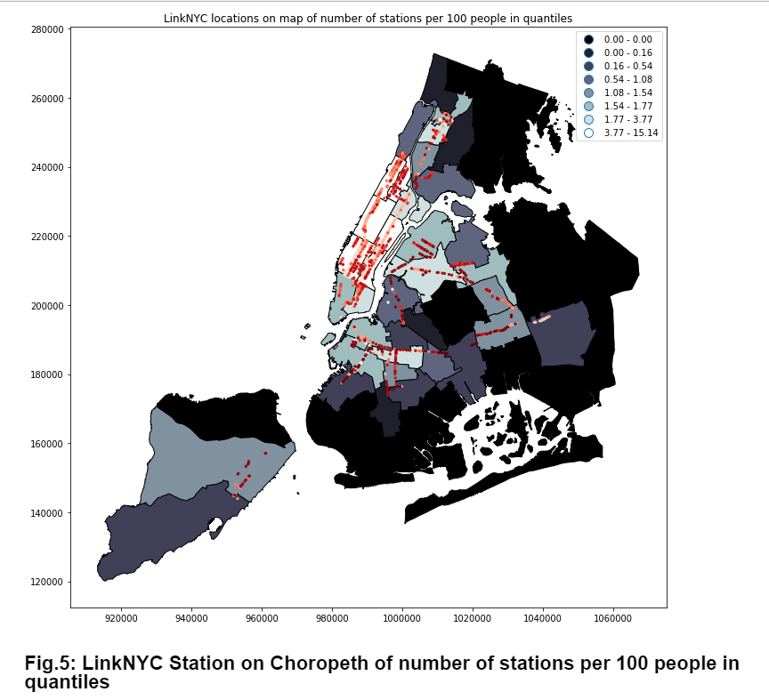

Assess if the linkNYC stations are located to provide a useful service and to fill in a need. We worked with the American Fact Finder data via API and direct download, and with NYC shapefiles. 

